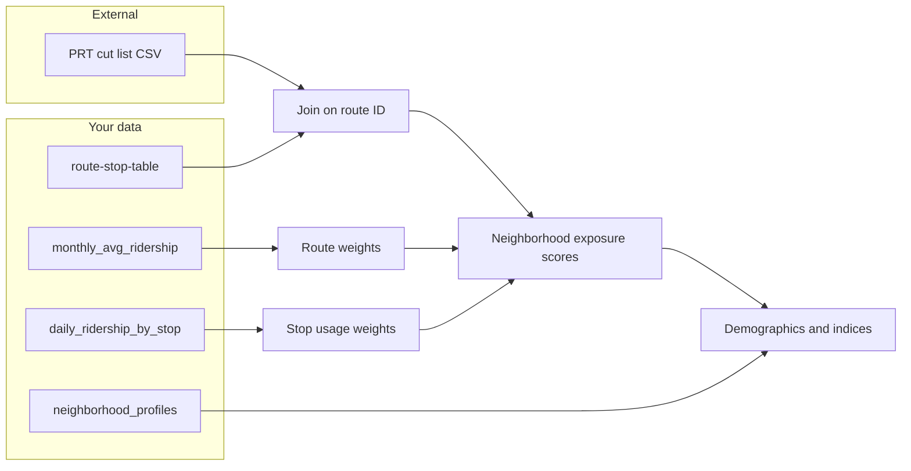

# Plan: Neighborhood impacts of proposed FY2026 PRT cuts

## Context and data you already have

| Asset                | File                                                                 | Role                                                                                                                                                                                                                                                                 |
| -------------------- | -------------------------------------------------------------------- | -------------------------------------------------------------------------------------------------------------------------------------------------------------------------------------------------------------------------------------------------------------------- |
| Service geography    | [data/route-stop-table.csv](data/route-stop-table.csv)               | Stops with `hood`, `munihood_display`, `routes` / `route_sort`, weekly trip counts (`trips_wd`, `trips_sa`, `trips_su`, `trips_7d`), census `GEOIDFQ`                                                                                                                |
| Route demand         | [data/monthly_avg_ridership.csv](data/monthly_avg_ridership.csv)     | Route-level `avg_riders` by `day_type` and month — use to weight **which routes matter** for riders                                                                                                                                                                  |
| Stop usage over time | [data/daily_ridership_by_stop.csv](data/daily_ridership_by_stop.csv) | `avg_ons` / `avg_offs` by stop, route, era (`Pre-pandemic` / `Pandemic`) — **where** demand concentrates                                                                                                                                                             |
| Demographics         | [data/neighborhood_profiles.csv](data/neighborhood_profiles.csv)     | `NeighborhoodGroup` + `GeographyType` (includes `neighborhood`, `neighborhood group`, and regional rows). Rich 2012 vs 2022 ACS fields: `**Var_*_income_*`**, `**Var_*_poverty_*`**, `**Var_*_commuting_***` (mode to work), labor force, education, race, age, etc. |

**Critical gap:** None of the four files encode PRT’s **proposed** elimination vs major vs minor reduction **per route**. That classification lives in PRT’s [Funding Crisis](https://www.rideprt.org/2025-funding-crisis/funding-crisis/) narrative, appendices (“Download the Final Report”, Appendix 1–3), and related engagement pages (e.g. [transit service cuts](https://engage.rideprt.org/transit-cuts/transit-service)). You need a small **route-level reference table** (CSV you maintain) with at least: `route_id` (or string matching your `route` / `route_name` columns), `cut_type` (`eliminated` | `major` | `minor` | `unchanged`), and optionally `source` / `as_of_date` for documentation.

---

## Step 1: Normalize geography and route identifiers

- **Filter** [neighborhood_profiles.csv](data/neighborhood_profiles.csv) to rows where `GeographyType` is `neighborhood` (and optionally `neighborhood group` if you want broader units — pick one grain for the story and stick to it).
- **Build a name crosswalk** between `NeighborhoodGroup` and `hood` / `munihood_display` in [route-stop-table.csv](data/route-stop-table.csv). Expect minor string differences (e.g. punctuation, “Mount” vs “Mt”, combined names). Use explicit mapping table for exceptions.
- **Parse routes** in `route-stop-table`: `routes` can list multiple routes; `route_sort` / per-route rows (`E00175-54`) give cleaner one-route-per-row joins. Prefer deduplicating stops or aggregating at **route × neighborhood** level before summing trips.

---

## Step 2: Create the PRT “cut severity” layer (required for the thesis)

- Extract or transcribe the official **route-level** cut classification from PRT PDFs / tables into `prt_fy2026_route_cuts.csv` (or similar).
- **Match** PRT route numbers to your data: [monthly_avg_ridership](data/monthly_avg_ridership.csv) uses values like `1`, `28X`, `71B`; align zero-padding and suffixes (`P69` vs `69`) consistently across [daily_ridership_by_stop](data/daily_ridership_by_stop.csv) (`route_name`) and route-stop table.

---

## Step 3: Define “exposure” metrics (outcome variables)

Compute **neighborhood-level** measures (examples):

1. **Service supply at risk** — Sum `trips_7d` (or weekday-only if the story focuses on work trips) for stops whose **served routes** are eliminated or reduced, weighted by cut type (e.g. eliminated = 1.0, major = 0.5, minor = 0.25 — **document assumptions**).
2. **Rider-weighted exposure** — Multiply route-level exposure by recent `avg_riders` from [monthly_avg_ridership.csv](data/monthly_avg_ridership.csv) (filter to latest stable months; compare pre- vs post-pandemic if useful).
3. **Stop-intensity exposure** — Join [daily_ridership_by_stop](data/daily_ridership_by_stop.csv) to stops (via `stop_id` / lat-lon), aggregate `avg_ons + avg_offs` per neighborhood × route, then weight by cut severity.

**Insight angles:** neighborhoods with **high exposure** but **low car ownership / high transit commute share** are the core “transit dependency vs cuts” story; neighborhoods with high exposure and **low median income / high poverty share** support an **equity** angle.

---

## Step 4: Demographics and transit-dependency indices

Using **2022** columns in [neighborhood_profiles.csv](data/neighborhood_profiles.csv) (and documenting that the cut scenario is FY2026 — a projection — while ACS is survey-based):

- **Income:** Use `Var_2022_income_`* counts/shares to derive median band proxy or % below common thresholds if the schema supports it; at minimum compare **low-income share** across high- vs low-exposure neighborhoods.
- **Poverty:** `Var_2022_poverty_`* — share below poverty line.
- **Car-free / low-auto dependency:** Derive from `**Var_2022_commuting_`*** (typically public transit, walked, etc., vs drove alone) per ACS bucket definitions. If available in the same file, mobility / tenure fields may supplement; **verify column meanings** against the dataset codebook (if none ships with the CSV, document inferred ACS variable mapping).
- **Optional composite index:** z-score and combine normalized “% transit/walk commute” and “% zero-vehicle or no-car households” (only if definable from columns) into a simple **transit dependency score**; rank neighborhoods.

**Statistical sanity checks:** Spearman correlation between exposure metrics and income/poverty/transit mode; compare **top quartile** exposure vs **bottom quartile** on key demographics (with caution for small-N neighborhoods).

---

## Step 5: Notable trends to aim for (hypotheses to test)

- **Mismatch:** Areas with **highest** proposed service removal (by trips or ridership-weighted) also show **higher** poverty and **higher** transit mode share.
- **Spatial pattern:** Clusters of high exposure (map `hood` centroids or tract boundaries if you add a GeoJSON later).
- **Ridership vs cuts:** Routes with **high** historical ridership but **elimination** are especially strong “stakes” examples (from monthly + cut list).
- **Temporal:** [daily_ridership_by_stop](data/daily_ridership_by_stop.csv) supports a short sidebar on **pandemic-era decline** at stops that would also lose service — not required for the main FY2026 narrative but useful context.

---

## Step 6: Deliverables (choose based on your course/audience)

- **Analysis notebook** (Python or R): reproducible joins, one exported `neighborhood_exposure_demographics.csv` for charts.
- **Story artifact:** 3–5 charts (choropleth or bar-sorted exposure; scatter: transit dependency vs exposure; table of “most affected” neighborhoods) plus explicit **methods** paragraph (data sources, PRT cut list date, limitations).

---

## Risks and limitations (state in the story)

- **Proposed cuts ≠ final policy**; PRT’s page also notes [PennDOT capital funding](https://www.rideprt.org/2025-funding-crisis/funding-crisis/) and evolving plans — date-stamp your cut table.
- **Modifiable areal unit problem (MAUP):** neighborhoods are arbitrary; sensitivity-test at `neighborhood group` vs `neighborhood` if feasible.
- **ACS** is sample-based with margins of error; avoid over-precision on small areas.

